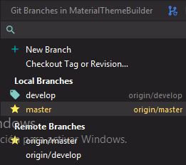
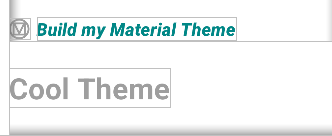
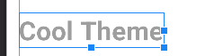

# Modificaciones 
1.Se ha creado una rama para las modificaciones : llamado develop

2.Se ha modificado el color del titulo,

3.Se ha modificado el color de los botones entre rosa y verde pastel

4.Se ha modificado el estilo del titulo, añadiendo bold

ver los cambios [aqui](app/src/main/res/values/color.xml)
otros [aqui](app/src/main/res/layout/activity_main.xml)
